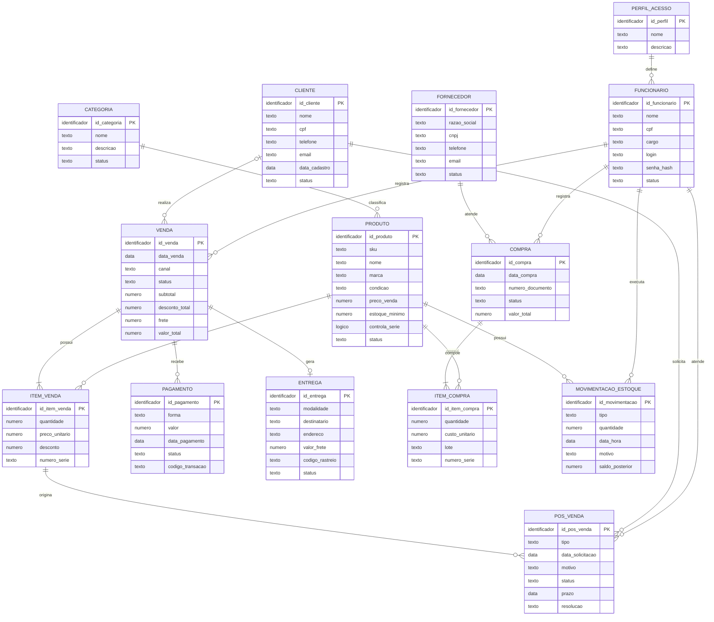

## 16. Diagrama Entidade-Relacionamento - DER

```mermaid
erDiagram
    PERFIL_ACESSO ||--o{ FUNCIONARIO : define
    CLIENTE o|--o{ VENDA : realiza
    FUNCIONARIO ||--o{ VENDA : registra
    VENDA ||--|{ ITEM_VENDA : possui
    PRODUTO ||--o{ ITEM_VENDA : compoe
    VENDA ||--o{ PAGAMENTO : recebe
    VENDA ||--o| ENTREGA : gera
    FORNECEDOR ||--o{ COMPRA : atende
    FUNCIONARIO ||--o{ COMPRA : registra
    COMPRA ||--|{ ITEM_COMPRA : possui
    PRODUTO ||--o{ ITEM_COMPRA : compoe
    CATEGORIA ||--o{ PRODUTO : classifica
    PRODUTO ||--o{ MOVIMENTACAO_ESTOQUE : possui
    FUNCIONARIO ||--o{ MOVIMENTACAO_ESTOQUE : executa
    ITEM_VENDA ||--o{ POS_VENDA : origina
    CLIENTE ||--o{ POS_VENDA : solicita
    FUNCIONARIO ||--o{ POS_VENDA : atende

    PERFIL_ACESSO {
        identificador id_perfil PK
        texto nome
        texto descricao
    }
    FUNCIONARIO {
        identificador id_funcionario PK
        texto nome
        texto cpf
        texto cargo
        texto login
        texto senha_hash
        texto status
    }
    CLIENTE {
        identificador id_cliente PK
        texto nome
        texto cpf
        texto telefone
        texto email
        data data_cadastro
        texto status
    }
    CATEGORIA {
        identificador id_categoria PK
        texto nome
        texto descricao
        texto status
    }
    PRODUTO {
        identificador id_produto PK
        texto sku
        texto nome
        texto marca
        texto condicao
        numero preco_venda
        numero estoque_minimo
        logico controla_serie
        texto status
    }
    FORNECEDOR {
        identificador id_fornecedor PK
        texto razao_social
        texto cnpj
        texto telefone
        texto email
        texto status
    }
    COMPRA {
        identificador id_compra PK
        data data_compra
        texto numero_documento
        texto status
        numero valor_total
    }
    ITEM_COMPRA {
        identificador id_item_compra PK
        numero quantidade
        numero custo_unitario
        texto lote
        texto numero_serie
    }
    VENDA {
        identificador id_venda PK
        data data_venda
        texto canal
        texto status
        numero subtotal
        numero desconto_total
        numero frete
        numero valor_total
    }
    ITEM_VENDA {
        identificador id_item_venda PK
        numero quantidade
        numero preco_unitario
        numero desconto
        texto numero_serie
    }
    PAGAMENTO {
        identificador id_pagamento PK
        texto forma
        numero valor
        data data_pagamento
        texto status
        texto codigo_transacao
    }
    ENTREGA {
        identificador id_entrega PK
        texto modalidade
        texto destinatario
        texto endereco
        numero valor_frete
        texto codigo_rastreio
        texto status
    }
    MOVIMENTACAO_ESTOQUE {
        identificador id_movimentacao PK
        texto tipo
        numero quantidade
        data data_hora
        texto motivo
        numero saldo_posterior
    }
    POS_VENDA {
        identificador id_pos_venda PK
        texto tipo
        data data_solicitacao
        texto motivo
        texto status
        data prazo
        texto resolucao
    }
```
